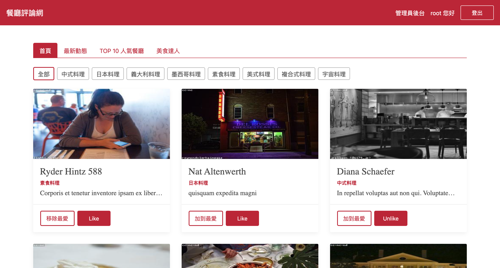

# Restaurant Forum Vue.js 3

A restaurant forum built with Vue 3 in Vite.

## Preview



## Features

```
帳號：
user1@example.com（一般用戶）
root@example.com（管理者）

密碼：一律為12345678
```

使用者可以

- 進行帳號註冊、登入
- 根據類別篩選餐廳
- 瀏覽單一餐廳資訊及其評論
- 對餐廳按喜歡、加入最愛、留下評論
- 查看、追蹤其他用戶
- 修改個人資料

管理者後台

- 新增、瀏覽、修改、刪除餐廳資訊
- 新增、編輯、刪除餐廳類別名稱
- 修改使用者身分為一般用戶或管理員

## Recommended IDE Setup

[VSCode](https://code.visualstudio.com/) + [Volar](https://marketplace.visualstudio.com/items?itemName=Vue.volar) (and disable Vetur) + [TypeScript Vue Plugin (Volar)](https://marketplace.visualstudio.com/items?itemName=Vue.vscode-typescript-vue-plugin).

## Customize configuration

See [Vite Configuration Reference](https://vitejs.dev/config/).

## Project Setup

```sh
npm install
```

### Compile and Hot-Reload for Development

```sh
npm run dev
```

### Compile and Minify for Production

```sh
npm run build
```

### Lint with [ESLint](https://eslint.org/)

```sh
npm run lint
```
